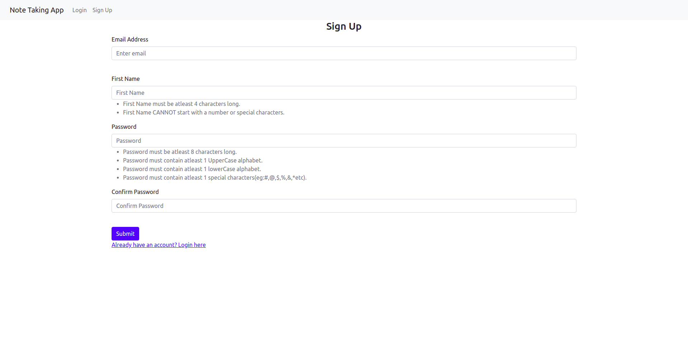
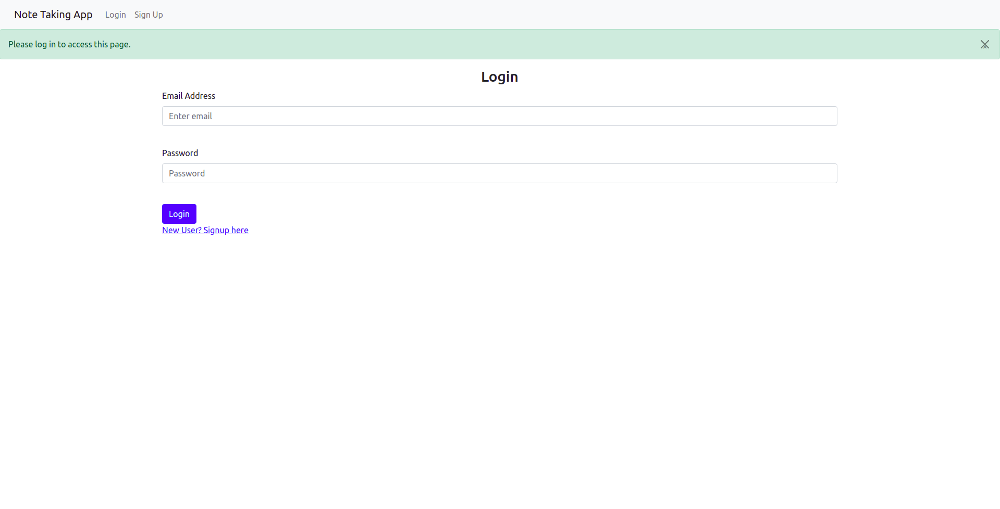
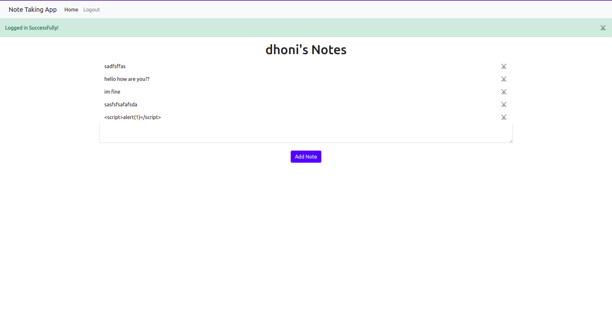

# Simple Note Taking App using Flask

Minimal Note Taking App 

## Sample images

## Functionalities

- Create a new user (Signup)
- Login only for signed up user (Login and Logouts)
- Create notes (NOT shared notes, each user can only see his notes)
- Delete notes (Only registerd users can delete/create notes)
- Cannot see other users notes
